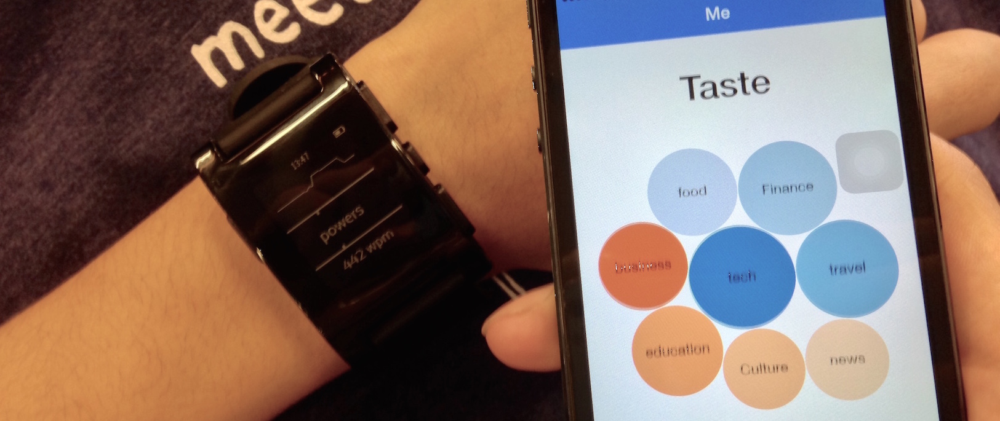
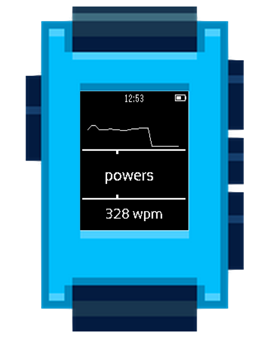
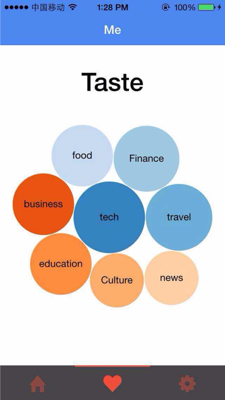

# MicroReader

We'd like to enhance reading experiences on tiny display screens. The idea is to combine big data with innovative display technology. MicroReader is a Pebble app that effectively flash streaming texts on smartwatch screen word by word, with content tailored to the taste of individual users. 

* 
*  

* note: the project is created during a 24hrs hackathon, so the code demands great improvement ..

# Features

*  Pebble part
   *  display title/summary (can read full featured article on phone, handoff feature)
   *  single click up/down button for like/dislike (note when opened on phone, will consider you like the article)
   *  single click select button to skip, and read next item
   *  double click up/down button to adjust reading speed.
   *  double click select button to adjust speed automatically (a simple algorithm that changes the rate according to word length and frequency)

*  content / backend part
   * 推荐系统
   * topic modeling, visualize topics.
      * 利用用户点击的+/- 作为supervision.

*  iOS part
   *  选择话题
   *  完整内容
   *  up vote / down vote
   *  用户偏好的可视化
      * 后台/手机显示用户的tag

# Reference

* Pebble
	* [Pebble Workbook](Pebble/Workbook.md)
	* [Other Pebble Projects](Pebble/PebbleProjects.md) 
* Spritz
 	* [Spritz SDK] (doc/sprtiz.md)
* [Ionic Framework] (http://ionicframework.com/)
	*  Install: npm install -g cordova ionic
* Content
	* RSS / Feed
		*	[The feedly Cloud API](http://developer.feedly.com/)
		*	[Entries](http://developer.feedly.com/v3/entries/), [Feeds](http://developer.feedly.com/v3/feeds/), [Tags](http://developer.feedly.com/v3/tags/)
